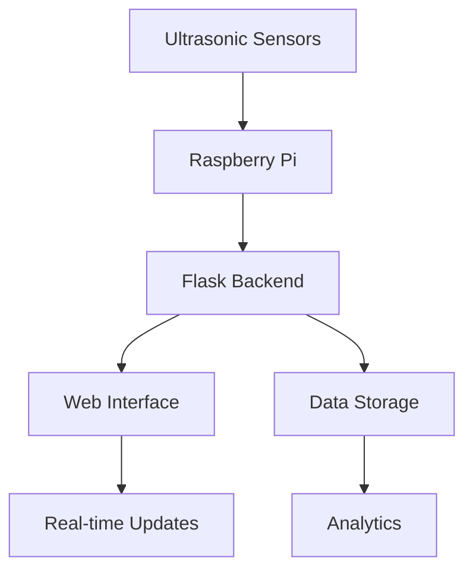

# 🚗 Smart Parking System

A simple yet powerful parking management system that helps you monitor parking spaces in real-time using Raspberry Pi and ultrasonic sensors. Perfect for small parking lots, garages, or personal use!

## 🎯 Quick Start Guide

1. **Connect Your Hardware**
   - Plug in your Raspberry Pi
   - Connect ultrasonic sensors to GPIO pins
   - Power up the system

2. **Install the Software**
   ```bash
   # Install required packages
   sudo apt-get update
   sudo apt-get install python3-pip

   # Install project dependencies
   pip3 install -r requirements.txt
   ```

3. **Run the System**
   ```bash
   python3 backend/app.py
   ```

4. **Access the Dashboard**
   - Open your web browser
   - Type: `http://[YOUR_RPI_IP]:5000`
   - Login with: username: `admin`, password: `admin123`

## 🛠️ What You'll Need

### Hardware
- Raspberry Pi (any model)
- HC-SR04 Ultrasonic Sensors (1 per parking spot)
- Jumper wires
- Power supply for Raspberry Pi

### Software
- Raspberry Pi OS (latest version)
- Python 3.x
- All required packages (listed in requirements.txt)

## 📱 How to Find Your Raspberry Pi IP

1. **Method 1: Using Terminal**
   ```bash
   hostname -I
   ```

2. **Method 2: Using Router**
   - Log into your router
   - Look for connected devices
   - Find your Raspberry Pi

## 🔧 Simple Configuration

Edit `backend/app.py` to customize:
- Number of parking spots
- Sensor sensitivity
- Update frequency
- Admin password

## 📊 What You Can Monitor

- Available parking spots
- Occupancy rate
- Usage history
- Real-time updates

## 🔒 Security

- Change the default password after first login
- Access only from your local network
- Basic authentication protection

## ❓ Need Help?

1. Check the troubleshooting guide
2. Contact support
3. Visit our GitHub issues page

## 📝 License

Free to use and modify for personal and commercial projects.

## 📊 System Architecture



## 🔧 Configuration

The system can be configured by modifying the following parameters in `backend/app.py`:

- Sensor pins configuration
- Distance thresholds
- Update intervals
- Admin credentials

## 📈 Data Visualization

The system provides several visualization features:

- Real-time occupancy status
- Historical occupancy trends
- Parking space usage statistics
- Occupancy rate charts

## 🔒 Security Features

- Secure admin authentication
- Session management
- Protected API endpoints
- Input validation

## 🤝 Contributing

Contributions are welcome! Please feel free to submit a Pull Request.

## 📞 Support

For support, please open an issue in the GitHub repository or contact the maintainers.

---

Made with ❤️ by [Your Name]
