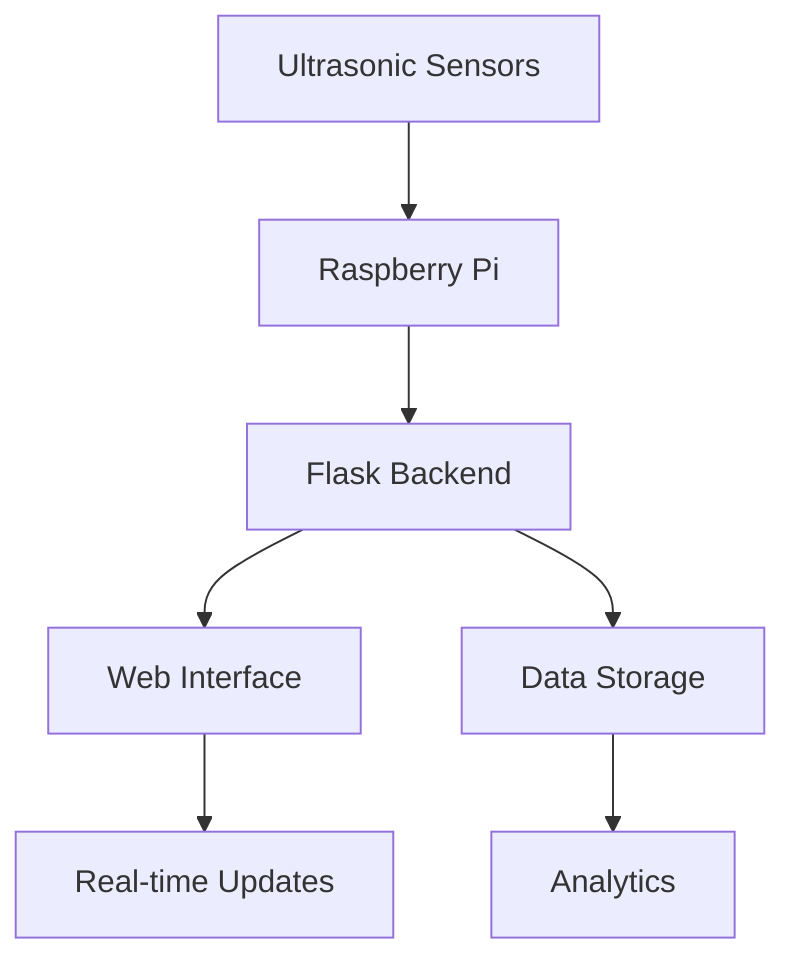

# 🚗 Smart Parking System

A modern, IoT-based smart parking system that uses ultrasonic sensors to monitor parking space occupancy in real-time. This system provides a user-friendly web interface for monitoring parking spaces, viewing occupancy history, and analyzing parking space usage patterns.


## 🌟 Features

- **Real-time Parking Monitoring**
  - Live status of each parking slot
  - Ultrasonic sensor-based occupancy detection
  - Visual indicators for occupied/available spaces

- **Advanced Analytics**
  - Occupancy rate tracking
  - Historical data visualization
  - Parking space usage statistics
  - Real-time occupancy trends

- **Secure Access**
  - Admin authentication system
  - Protected dashboard access
  - Secure API endpoints

- **Responsive Web Interface**
  - Modern, user-friendly dashboard
  - Real-time updates
  - Interactive charts and graphs
  - Mobile-responsive design

## 🛠️ Technical Stack

### Backend
- **Python Flask** - Web framework
- **RPi.GPIO** - Raspberry Pi GPIO control
- **Ultrasonic Sensors** - HC-SR04 for distance measurement
- **Threading** - Concurrent sensor monitoring

### Frontend
- **HTML5/CSS3** - Modern web interface
- **JavaScript** - Real-time updates and interactivity
- **Chart.js** - Data visualization
- **Bootstrap** - Responsive design

## 📋 Hardware Requirements

- Raspberry Pi (any model with GPIO pins)
- HC-SR04 Ultrasonic Sensors
- Jumper wires
- Power supply
- Optional: LED indicators

## 🚀 Getting Started

### Prerequisites
- Python 3.x
- Flask
- RPi.GPIO
- Raspberry Pi OS

### Installation

1. Clone the repository:
```bash
git clone https://github.com/yourusername/smart-parking-system.git
cd smart-parking-system
```

2. Install dependencies:
```bash
pip install -r requirements.txt
```

3. Configure the system:
- Connect ultrasonic sensors to GPIO pins as specified in the code
- Update sensor configurations if needed

4. Run the application:
```bash
python backend/app.py
```

5. Access the web interface:
- Open your browser and navigate to `http://localhost:5000`
- Login with admin credentials (default: admin/admin123)

## 📊 System Architecture



## 🔧 Configuration

The system can be configured by modifying the following parameters in `backend/app.py`:

- Sensor pins configuration
- Distance thresholds
- Update intervals
- Admin credentials

## 📈 Data Visualization

The system provides several visualization features:

- Real-time occupancy status
- Historical occupancy trends
- Parking space usage statistics
- Occupancy rate charts

## 🔒 Security Features

- Secure admin authentication
- Session management
- Protected API endpoints
- Input validation

## 🤝 Contributing

Contributions are welcome! Please feel free to submit a Pull Request.

## 📝 License

This project is licensed under the MIT License - see the LICENSE file for details.

## 📞 Support

For support, please open an issue in the GitHub repository or contact the maintainers.

---

Made with ❤️ by [Your Name]
